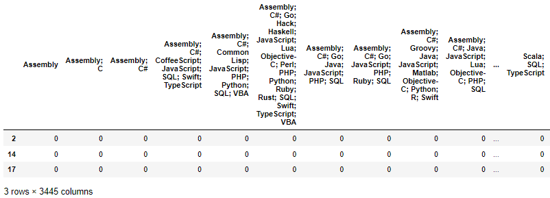
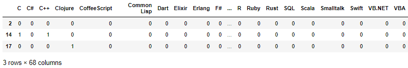

# A new way to solve the problem of one hot encoding

***

## Motive

One hot encoding is possible with object column by using the get dummies function of Pandas.
This can be used for machine learning as a good way to deal with categorical data.

However, there is a problem that one hot encoding can create too many columns if done wrong.
For example, if you look at a specific column in the project file, you can see that there are various values.
In this situation, if you use the get dummies function as it is, the number of columns increases too much.
Therefore, in this project, I will make a dummy using the method I have defined and compare the results with the existing method.

***

## Libraries

* Pandas
* Numpy
* Scikit learn

***

## Dataset

* Stackoverflow survey 2017
    * https://www.kaggle.com/datasets/stackoverflow/so-survey-2017

***

## Analysis

The salary was predicted using linear regression of scikit learn. 
I compared the results according to the method of finding the dummy, and tried a method that could get a better result.

In general, it is often the case that the dummies are obtained just before fit() the get dummies in the machine learning algorithm. 
However, in my case, it takes a long time to find the dummy, and I use the dummy many times in various ways. 
Therefore, it takes a lot of time to find a dummy every time it fit(), so I choose a method to create a dummy df in advance and store it in a dictionary and call it whenever necessary.

***

## Acknowledgement

R2 score was used to judge how accurately the prediction was made. 
There was no significant difference to r2 score in the methods of finding the two dummy. 
However, there was a big difference in the time to obtain the r2 score. 
This is presumably because there was a large difference in the number of columns when finding the dummy, and as the number of columns increased, it took a lot of time for regression.

***

### This repository is project of Udacity's Data Science course 1.

### Related articles are posted on my blog.
